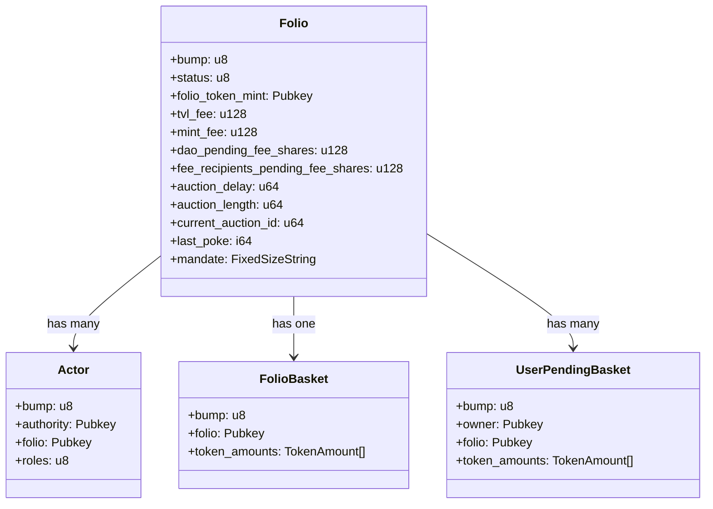
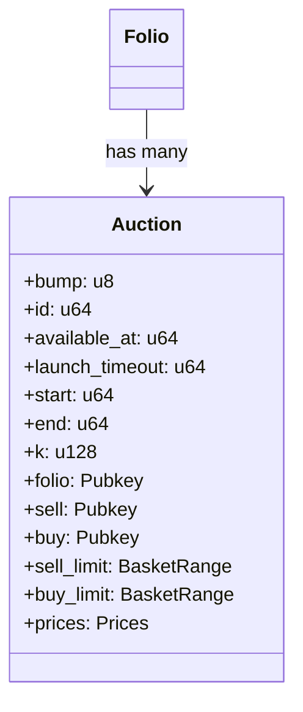
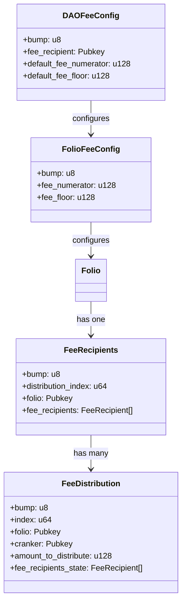
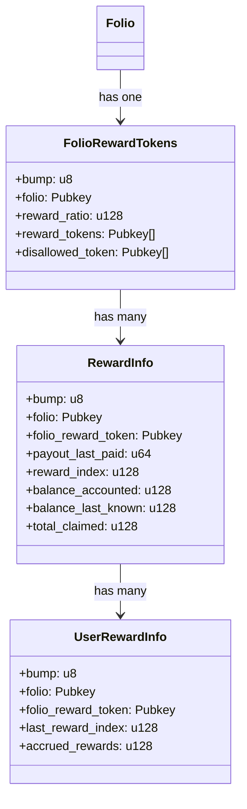
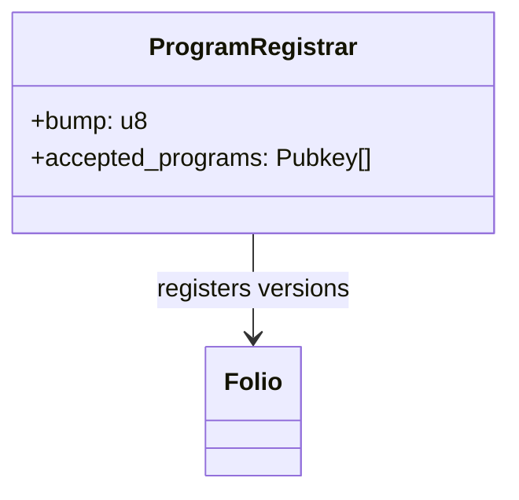

# Folio Protocol

## Table of Contents
- [Overview](#overview)
- [Decimal Precision](#decimal-precision)
- [Mathematical Utilities](#mathematical-utilities)
- [Protocol Flows](#protocol-flows)
- [Protocol Explanation](#protocol-explanation)
- [Build Guide](#build-guide)
- [Testing Guide](#testing-guide)

## Overview

Reserve Folio is a protocol for creating and managing portfolios of SPL-compliant assets entirely onchain. Folios are designed to be used as a single-source of truth for asset allocations, enabling composability of complex, multi-asset portfolios.

Folios support rebalancing via Dutch Auction over an exponential decay curve between two prices. Control flow over the auction is shared between two parties, with a AUCTION_APPROVER approving auctions in advance and a AUCTION_LAUNCHER opening them, optionally providing some amount of additional detail. Permissionless execution is available after a delay.

AUCTION_APPROVER is expected to be the SPL Governance account configured for fast-moving decisions associated with the Folio

AUCTION_LAUNCHER is expected to be a semi-trusted wallet or multisig; They can open auctions within the bounds set by governance, hopefully adding basket definition and pricing precision. If they are offline the auction can be opened permissionlessly after a preset delay. If they are evil, at-best they can deviate rebalancing within the governance-granted range, or prevent a Folio from rebalancing entirely by repeatedly closing-out auctions.


## Decimal Precision

### Precision Levels
The protocol implements two precision levels for different operations:
- **D9 (1e9)**: Standard Solana token decimal precision
- **D18 (1e18)**: Enhanced precision for complex calculations

### Implementation Details

#### Solana Token Standard (D9)
- Native precision level for Solana token mints
- Used for all token-related transactions
- Maximum supported decimal precision in protocol

#### Enhanced Precision (D18)
- Used for advanced calculations requiring higher precision
- Handles precision loss mitigation
- Conversion process to D9:
  - Values are floored for token operations
  - Sub-D9 precision ("dust") is retained
  - Accumulated dust compounds into complete D9 units over time

### Variable Naming Conventions
> Note: These conventions exclude `state.rs` account definitions to maintain Solidity compatibility.

- `raw_`: Indicates D9 precision (token amounts)
- `scaled_`: Indicates D18 precision (calculation values)

## Mathematical Utilities

### Core Operations
The `math_util.rs` module provides high-precision mathematical operations:
- Basic arithmetic (`add`, `sub`, `mul`, `div`)
- Power function (`pow`) using binary exponentiation

### Advanced Functions

#### Nth Root Implementation
Two-tiered approach based on input size:

1. Large Values (n > 1,000,000):
   - Taylor series approximation near x = 1
   - Three-term series expansion
   - Formula: 1 - x/n + (n-1)x²/(2n²) - (n-1)(n-2)x³/(6n³)

2. Standard Values (n ≤ 1,000,000):
   - Binary search implementation
   - 15 iteration maximum
   - Optimized for accuracy/performance balance

#### Natural Logarithm (ln)
Implementation features:
- Input normalization (1 to e range)
- arctanh Taylor series expansion
- Formula: ln((1+x)/(1-x)) = 2 * arctanh(x)
- Epsilon precision: 1e-18

#### Exponential Function (exp)
Implementation features:
- Taylor series: e^x = 1 + x + x²/2! + x³/3! + ...
- Dynamic iteration termination
- Bi-directional exponent support
- Epsilon precision: 1e-18

### Error Handling
- D18 precision maintenance
- Comprehensive overflow protection
- U256 internal calculations
- Result-based error handling

## Protocol Flows

### Folio Initialization
1. Execute `init_folio`
2. Add tokens via `add_to_basket` (supports multiple transactions for large baskets)
   > Note: Providing `initial_shares` enables immediate minting capability

### Minting Process
1. Add tokens to pending basket:
   - Use `add_to_pending_basket` for 1-N tokens
   - Tokens transfer immediately but remain "pending"
   - Reversible via `remove_from_pending_basket`

2. Execute minting:
   - Call `mint_folio_token`
   - Maximum 18 tokens without lookup table

### Redemption Process
1. Burn tokens:
   - Execute `burn_folio_token`
   - Irreversible operation
   - Adds proportional tokens to pending basket

2. Claim tokens:
   - Use `redeem_from_pending_basket`
   - Supports multiple transactions for large baskets

### Migration Protocol
For security, the program is non-upgradeable. Migration process:
- Program owner initiates migration
- Permissionless token transfer
- New version handles account structure migration
- Whitelist-restricted program migration

### Governance Integration
- Integrated with custom SPL governance program
- Reward-enabled Folios owned by DAO via Governance PDA
- Administrative functions require DAO voting:
  - Reward token management
  - Ratio configuration
  - General administration

## Protocol Explanation

### Roles

##### Folio

A Folio has 3 roles:

1. `OWNER`
   - Expected: SPL Governance account of Realm with slow configuration
   - Can add/remove assets, set fees, configure auction length, set the auction delay, and closeout auctions
   - Can configure the `AUCTION_APPROVER`/ `AUCTION_LAUNCHER`
   - Primary owner of the Folio
2. `AUCTION_APPROVER`
   - Expected: SPL Governance account of Relam with fast configuration
   - Can approve auctions
3. `AUCTION_LAUNCHER`
   - Expected: wallet or multisig
   - Can open and close auctions, optionally altering parameters of the auction within the approved ranges

### Rebalancing

##### Auction Lifecycle

1. Auction is approved by governance, including an initial price range
2. Auction is opened, initiating the progression through the predetermined price curve
   a. ...either by the auction launcher (immediately, or soon after)
   b. ...or permissionlessly (after the auction delay passes)
3. Bids occur
4. Auction expires

##### Auction Usage

###### Buy/Sell limits

Governance configures buy and sell limits for the basket ratios, including a spot estimate:

```rust
pub struct BasketRange {
    pub spot: u128,    /// D18{tok/share}
    pub low: u128,     /// D18{tok/share} inclusive
    pub high: u128,    /// D18{tok/share} inclusive
}

sell_limit: BasketRange; // D18{sellTok/share} min ratio of sell tokens in the basket, inclusive
buy_limit BasketRange; // D18{buyTok/share} max ratio of buy tokens in the basket, exclusive
```

During `open_auction` the `AUCTION_LAUNCHER` can set the buy and sell limits within the approved ranges provided by governance. If the auction is opened permissionlessly instead, the governance pre-approved spot estimates will be used instead.

###### Price

There are broadly 3 ways to parametrize `[start_price, end_price]`, as the `AUCTION_APPROVER`:

1. Can provide `[0, 0]` to _fully_ defer to the auction launcher for pricing. In this mode the auction CANNOT be opened permissionlessly. Loss can arise either due to the auction launcher setting `start_price` too low, or due to precision issues from traversing too large a range.
2. Can provide `[start_price, 0]` to defer to the auction launcher for _just_ the `end_price`. In this mode the auction CANNOT be opened permissionlessly. Loss can arise due solely to precision issues only.
3. Can provide `[start_price, end_price]` to defer to the auction launcher for the `start_price`. In this mode the auction CAN be opened permissionlessly, after a delay. Suggested default option.

The `AUCTION_LAUNCHER` can always choose to raise `start_price` within a limit of 100x, and `end_price` by any amount. They cannot lower either price.

The price range (`start_price / end_price`) must be less than `1e9` to prevent precision issues.

###### Lot Sizing

Auction lots are sized by `Auction.sell_limit` and `Auction.buy_limit`. Both correspond to Folio structs about basket ratios that must be maintained throughout the auction:

- `sell_limit` is the min amount of sell token in the basket `D18{sellTok/share}`
- `buy_limit` is the max amount of buy token in the basket `D18{buyTok/share}`

In general it is possible for the `lot` to both increase and decrease over time, depending on whether `sell_limit` or `buy_limit` is the constraining factor in sizing.

###### Auction Participation

Anyone can bid in any auction in size up to and including the `lot` size.

### Fee Structure

Folios support 2 types of fees. Both have a DAO portion that work the same underlying way, placing limits on how small the fee can be.

##### `tvl_fee`

**Per-unit time fee on AUM**

The DAO takes a cut with a minimum floor of 15 bps. A consequence of this is that the Folio always inflates at least 15 bps annually. If the tvl fee is set to 15 bps, then 100% of this inflation goes towards the DAO.

##### `mint_fee`

**Fee on mints**

The DAO takes a cut with a minimum floor of 15 bps. The DAO always receives at least 15 bps of the value of the mint. If the mint fee is set to 15 bps, then 100% of the mint fee is taken by the DAO.

#### Fee Floor

The universal 15 bps fee floor can be lowered by the DAO, as well as set (only lower) on a per Folio basis.

## Build Guide

### Prerequisites

1. Required Repositories:
   - Custom SPL Governance: [reserve-protocol/solana-program-library](https://github.com/reserve-protocol/solana-program-library)
   - Repository structure:
     ```
     parent_directory/
     ├── dtfs-solana/         # Main repository
     └── solana-program-library/  # Custom SPL Governance
     ```

2. Development Tools:
   ```bash
   # Install Rust
   curl --proto '=https' --tlsv1.2 -sSf https://sh.rustup.rs | sh -s -- -y --default-toolchain 1.83

   # Install Solana
   sh -c "$(curl -sSfL https://release.anza.xyz/v2.1.0/install)"

   # Configure PATH
   echo 'export PATH="$HOME/.local/share/solana/install/active_release/bin:$PATH"' >> ~/.zshrc
   source ~/.zshrc

   # Install Anchor
   cargo install --git https://github.com/coral-xyz/anchor avm --force
   avm install 0.30.1
   avm use 0.30.1
   ```

### Environment Setup

1. Configuration Files:
   - Copy `.env.example` to `.env`
   - Configure required variables:
     ```
     ADMIN_PUBKEY=AXF3tTrMUD5BLzv5Fmyj63KXwvkuGdxMQemSJHtTag4j
     SPL_GOVERNANCE_PROGRAM_ID=HwXcHGabc19PxzYFVSfKvuaDSNpbLGL8fhVtkcTyEymj
     ```

2. Key Management:
   > Note: Local Development keys are included in `/utils/keys/`
   - `folio_admin-keypair-local.json`: Folio Admin program ID
   - `folio-keypair-local.json`: Folio Primary program ID
   - `folio-2-keypair-local.json`: Folio Secondary program ID
   - `spl-governance-keypair.json`: Custom Governance program ID
   - `keys.json`: Test configuration keys

### Build Configuration

#### Environment Settings
Configure `Anchor.toml` for target environment:
```toml
[provider]
cluster = "Localnet"  # Options: Localnet, Devnet, Mainnet
wallet = "~/.config/solana/id.json"

[programs.localnet]
folio = "n6sR7Eg5LMg5SGorxK9q3ZePHs9e8gjoQ7TgUW2YCaG"
folio_admin = "7ZqvG9KKhzA3ykto2WMYuw3waWuaydKwYKHYSf7SiFbn"
```

#### Build Process
Execute `build-local.sh`:
1. SPL Governance compilation
2. Dual Folio program builds:
   - Standard instance
   - Development instance (feature-enabled) (can be migrated to for testing purposes)

### Key Management

#### Program ID Generation
```bash
# Generate new keypairs
solana-keygen new -o folio_admin-keypair.json --no-bip39-passphrase
solana-keygen new -o folio-keypair.json --no-bip39-passphrase

# View public keys
solana address -k target/deploy/folio_admin-keypair.json
solana address -k target/deploy/folio-keypair.json
```

> Important: Backup deployment keys for devnet/mainnet environments to maintain upgrade capability

## Testing Guide

The protocol implements three distinct testing approaches to ensure comprehensive coverage and reliability.

### 1. Rust Unit Tests

Located under the `tests/` directory, these tests focus on pure Rust functions without Anchor-specific parameters.

#### Characteristics
- Tests functions without `Account`, `AccountInfo`, or `AccountLoader` parameters
- Fast execution and simple setup
- Ideal for testing mathematical operations and utility functions

#### Running Unit Tests
```bash
# Standard test execution
cargo test

# With coverage reporting
cargo tarpaulin --workspace \
                --exclude-files \
                "programs/*/src/instructions/*" \
                "programs/*/src/external/*" \
                "programs/*/src/**/events.rs" \
                "programs/*/src/**/state.rs" \
                "programs/*/src/lib.rs" \
                "programs/*/src/**/errors.rs" \
                --out Html \
                --output-dir target/tarpaulin
```

> Note: Some functions are intentionally excluded from coverage metrics due to the complexity of mocking Anchor structures. These typically involve Account-related parameters.

### 2. Bankrun Tests

Located under `tests-ts/bankrun/`, these tests provide a middle ground between unit and integration tests.

#### Features
- Simulates on-chain behavior without requiring a validator
- Faster than full integration tests
- Tests program instructions and account interactions

#### Setup and Execution
```bash
# 1. Build programs
./build-local.sh

# 2. Download required programs
./download-programs.sh

# 3. Run tests
anchor run test-bankrun
```

> Note: Bankrun tests don't require a Solana test validator, making them significantly faster than traditional integration tests.

### 3. Integration Tests

Located under `tests-ts/tests-*.ts`, these tests provide full end-to-end testing of the protocol.

#### Features
- Complete on-chain interaction testing
- Tests cross-program interactions
- Validates real-world scenarios

#### Setup and Execution

1. Start the test environment:
   ```bash
   # Terminal 1
   ./start-amman.sh
   ```

2. Run the tests:
   ```bash
   # Terminal 2
   tsc && anchor test --skip-local-validator --skip-deploy --skip-build
   ```

#### Test Configuration
- Uses Amman for transaction monitoring
- Skips local validator (using Amman instead)
- Skips deployment and build (assuming programs are pre-built)

### Test Organization
```bash
project/
├── tests/ # Rust unit tests
├── tests-ts/
│ ├── bankrun/ # Bankrun tests
│ │ └── test-runner.ts
│ └── tests-*.ts # Integration tests
```

### Best Practices

1. **Unit Tests**
   - Write for all pure functions
   - Focus on edge cases and error conditions
   - Maintain high coverage for non-Account functions

2. **Bankrun Tests**
   - Test instruction logic
   - Validate account constraints
   - Verify state transitions

3. **Integration Tests**
   - Test complete user flows
   - Verify cross-program interactions
   - Validate real-world scenarios

## Architecture Diagrams

### Core Account Structure


### Auction System


### Fee Management


### Reward System


### Program Registry


### Core Program Flow
```mermaid
sequenceDiagram
    participant Owner as Folio Owner (DAO)
    participant Approver as Auction Approver
    participant Launcher as Auction Launcher
    participant User
    participant Folio
    
    %% Initialization Flow
    rect rgb(106, 106, 116)
        Note over Owner, Folio: Initialization Phase
        Owner->>Folio: init_folio()
        Owner->>Folio: init_or_update_actor(AUCTION_APPROVER)
        Owner->>Folio: init_or_update_actor(AUCTION_LAUNCHER)
        Owner->>Folio: add_to_basket(initial_tokens)
    end

    %% Auction Flow
    rect rgb(91, 81, 81)
        Note over Approver, Folio: Auction Phase
        Approver->>Folio: approve_auction(price_range, limits)
        alt Immediate Launch
            Launcher->>Folio: open_auction()
        else After Delay
            User->>Folio: open_auction_permissionless()
        end
        User->>Folio: bid()
        opt If needed
            Launcher->>Folio: close_auction()
        end
    end

    %% User Operations
    rect rgb(52, 55, 52)
        Note over User, Folio: User Operations
        User->>Folio: add_to_pending_basket()
        User->>Folio: mint_folio_token()
        User->>Folio: burn_folio_token()
        User->>Folio: redeem_from_pending_basket()
    end

    %% Reward Management
    rect rgb(42, 36, 36)
        Note over Owner, Folio: Reward Management
        Owner->>Folio: add_reward_token()
        User->>Folio: accrue_rewards()
        User->>Folio: claim_rewards()
    end

    %% Fee Management
    rect rgb(32, 36, 36)
        Note over User, Folio: Fee Distribution
        User->>Folio: poke_folio()
        User->>Folio: distribute_fees()
        User->>Folio: crank_fee_distribution()
    end